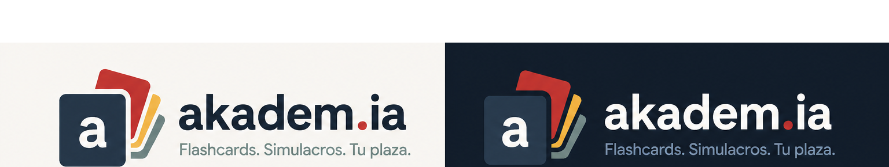
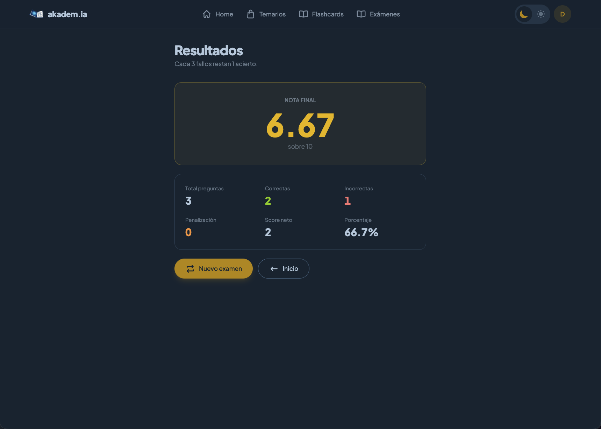

<p align="center">
  
</p>
<p align="center">
  
  
</p>
<p align="center">
  AI-assisted exam preparation platform with timed exams, spaced repetition flashcards and AI-generated quizzes from PDFs.
</p>

<p align="center">
  <a href="https://akademia.diegobarrioh.dev">▶️ Live Demo</a>
  •
  <a href="https://github.com/guilu/akadem.ia">📦 Repository</a>
</p>

<p align="center">
  <a href="https://github.com/guilu/akadem.ia/stargazers"></a>
  <a href="https://github.com/guilu/akadem.ia/commits/main"></a>
  
  
  
  
</p>

---

## ✨ Features

- 📝 Timed exams and mock tests
- 🛒 Course store with stripe integration
- 🧠 SM-2 spaced repetition flashcards
- 🤖 AI-generated quizzes from PDFs (RAG)
- 🔐 JWT + Google OAuth2 authentication
- 📚 Subjects → Units → Questions hierarchy
- 📦 Dockerized full stack
- 📱 Responsive UI
- ⚡ Spring Boot + React + Tailwind

---

## 📸 Screenshots

### Store Page

<p align="center">
  
  
</p>
<p align="center">
  
  
</p>

---

### Exam Builder

<p align="center">
  
  
</p>

---

### Exam Session

<p align="center">
  
  
</p>
---

### Flashcards Study


---

### AI PDF Quiz Generation

<p align="center">
  
  
</p>

---

## 🚀 Live Demo

🔗 <https://akademia.diegobarrioh.dev>

---

## 🏗️ Tech Stack

### Backend

- Java 21
- Spring Boot 3.3
- Spring Security + JWT
- PostgreSQL 16
- Apache PDFBox
- OpenAI API

### Frontend

- React 18
- Vite
- Tailwind CSS
- Flowbite React

### Infrastructure

- Docker Compose
- Nginx
- PostgreSQL

---

## 🚀 Quick Start

```bash
docker compose up --build
```

### Services

| Service | URL |
|---|---|
| Frontend | <http://localhost:5173> |
| API | <http://localhost:8080> |
| Postgres | localhost:5432 |

---

## 🐳 Docker Network

The `docker-compose.yml` uses an external Docker network called `cluster_network`.

Create it before running the stack:

```bash
docker network create cluster_network
```

---

## 🧱 Backend Architecture

The backend follows a **Hexagonal Architecture (Ports & Adapters)** approach.

```text
com.akdemya
├── adapter
│   ├── inbound/web
│   ├── infrastructure
│   └── outbound/persistence
├── application/service
├── domain
│   ├── model
│   └── port
└── Application.java
```

---

## 🔐 Security

- JWT stateless authentication
- Google OAuth2 login
- BCrypt password hashing
- Role-based access control
- Admin-only AI endpoints

---

## 🧠 AI Features

Akadem.ia supports AI-assisted quiz generation from PDF documents:

- PDF upload
- Text extraction with Apache PDFBox
- Semantic chunking
- OpenAI embeddings
- GPT-4o-mini question generation
- Draft approval workflow

---

## 📚 Flashcards System

Built-in flashcards system with:

- SM-2 spaced repetition
- AGAIN / HARD / GOOD / EASY grading
- Study queues
- Import/export
- Review history
- Daily study limits

---

## ⚙️ Environment Variables

```env
JWT_SECRET=
GROQ_API_KEY=
OPENROUTER_API_KEY=
GOOGLE_CLIENT_ID=
GOOGLE_CLIENT_SECRET=
FRONTEND_URL=
STRIPE_SECRET_KEY=sk_test_...
STRIPE_WEBHOOK_SECRET=whsec_...
RESEND_API_KEY=re_...
RESEND_FROM_EMAIL=
PRODUCTS_STORAGE_PATH=
```

---

## 🚚 Production Deployment

```bash
docker compose -f dist/docker-compose-prod.yaml up -d
```

---

## ✅ Roadmap

- [ ] pgvector integration
- [ ] Async PDF processing
- [ ] Advanced analytics
- [ ] Multiplayer study sessions
- [ ] Native mobile app
- [ ] AI study assistant

---

## 💖 Apoyar el proyecto

Akadem.ia es un proyecto open source mantenido en mi tiempo libre. Si te resulta útil y quieres ayudar a que siga creciendo:

- ⭐ Dale una estrella al repo — es gratis y ayuda muchísimo a la visibilidad
- 💛 [Conviérteme en sponsor en GitHub](https://github.com/sponsors/guilu) — soporte recurrente
- ☕ [Invítame a un café](https://buymeacoffee.com/diegobarrioh) — donación puntual
- 🐛 Abre issues o PRs con bugs, ideas o mejoras

Cualquier apoyo se traduce directamente en más tiempo para desarrollar features, mejorar la IA y mantener la plataforma online.

---

## 📄 License

MIT
