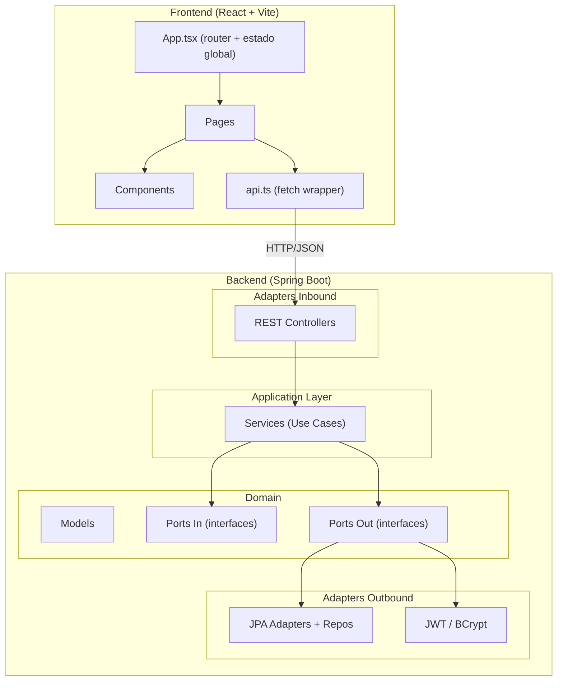
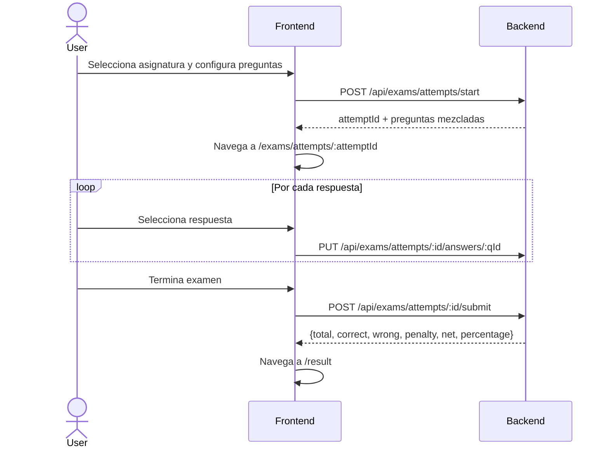

# Akadem.ia — Reporte de Arquitectura

> Análisis completo del proyecto: decisiones de diseño, arquitectura, puntos de mejora y deuda técnica.

---

## 📦 Tech Stack

| Capa | Tecnología |
|---|---|
| Frontend | React 18, Vite, TypeScript, Tailwind CSS 3, Flowbite React, React Router v6 |
| Backend | Java 21, Spring Boot 3.3, Spring Security, Spring Data JPA |
| Auth | JWT (HS256) — librería JJWT |
| Base de datos | PostgreSQL 18 |
| Infra | Docker Compose (dev y prod) |

---

## 🧱 Arquitectura General

El proyecto sigue una **arquitectura hexagonal (Ports & Adapters)** en el backend, con un frontend en React que consume la API REST.



---

## 🔷 Backend — Capas en Detalle

### 1. Domain (`domain/model`)

Entidades del dominio **puras**, sin dependencias de frameworks. Son clases Java con getters y métodos de fábrica.

| Entidad | Rol |
|---|---|
| `Subject` | Asignatura |
| `Unit` | Unidad temática dentro de una asignatura |
| `Question` | Pregunta perteneciente a una unidad |
| `Answer` | Respuesta de una pregunta (con flag `isCorrect`) |
| `AppUser` | Usuario del sistema (email, hash, rol, nombre, ocupación) |
| `ExamAttempt` | Intento de examen de un usuario |
| `ExamAttemptAnswer` | Respuesta seleccionada para cada pregunta en un intento |

**Decisión notable**: Los modelos de dominio son mayoritariamente inmutables. `ExamAttempt` tiene dos excepciones mutables: `finishedAt` y `score`, modificadas por el método `finish()`.

---

### 2. Ports (`domain/port`)

Interfaces que desacoplan el dominio de la infraestructura.

**Ports In (casos de uso):**
- `AuthUseCase` — registro + login
- `ExamUseCase` — start, submit, getAttempt, listAttempts, updateAnswer

**Ports Out (repositorios / servicios externos):**
- `SubjectRepository`, `UnitRepository`, `QuestionRepository`, `AnswerRepository`
- `ExamAttemptRepository`, `ExamAttemptAnswerRepository`
- `UserRepository`
- `PasswordHasher` (abstracción sobre BCrypt)
- `TokenProvider` (abstracción sobre JWT)

---

### 3. Application Services (`application/service`)

| Servicio | Descripción |
|---|---|
| `AuthManager` | Implementa `AuthUseCase`. Valida email/contraseña, hashea con `PasswordHasher`, genera JWT con `TokenProvider`. Todas las validaciones de dominio (email válido, contraseña ≥ 8 chars, confirmación) están aquí. |
| `ExamManager` | Implementa `ExamUseCase`. Lógica de inicio de examen (selección aleatoria de preguntas), submit con scoring, update de respuesta individual, listado de intentos. |
| `ContentManagement` | Servicio sin puerto de entrada propio. Gestiona CRUD de Subjects, Units, Questions y Answers. Impone la regla de negocio: **máximo 4 respuestas por pregunta**. |
| `ExamScoringCalculator` | Clase utilitaria (sin Spring). Calcula `net = correct - (wrong / 3)` con penalización por respuesta incorrecta. |

> [!IMPORTANT]
> `ContentManagement` **no implementa ningún puerto de entrada** (`port/in`). Los controladores Admin lo inyectan directamente. Esto es una ruptura menor de la arquitectura hexagonal pura.

---

### 4. Adapters Inbound — REST Controllers

| Controller | Ruta base | Auth requerida |
|---|---|---|
| `AuthController` | `/api/auth` | No |
| `SubjectController` | `/api/subjects` | Sí |
| `UnitController` | `/api/units` | Sí |
| `QuestionController` | `/api/questions` | Sí |
| `ExamController` | `/api/exams` | Sí |
| `AdminSubjectController` | `/api/admin/subjects` | Sí (ADMIN) |
| `AdminUnitController` | `/api/admin/units` | Sí (ADMIN) |
| `AdminQuestionController` | `/api/admin/questions` | Sí (ADMIN) |
| `AdminUserController` | `/api/admin/users` | Sí (ADMIN) |

> [!NOTE]
> Existe **duplicidad de controladores** para contenido: hay un controller público (`SubjectController`) y uno admin (`AdminSubjectController`) para las mismas entidades. El de admin añade operaciones de escritura protegidas por rol `ADMIN`.

> [!WARNING]
> Los Admin controllers inyectan **directamente los repositorios del puerto de salida** (`SubjectRepository`, `UnitRepository`...) en lugar de pasar por un servicio de aplicación. Esto viola la arquitectura hexagonal: la capa de aplicación debería ser el único cliente de los ports out.

---

### 5. Adapters Outbound — Persistencia

Cada entidad de dominio tiene:
- Un `*Entity` (JPA entity con anotaciones)
- Un `*Mapper` (conversión domain ↔ entity)
- Un `SpringData*Repository` (interfaz JPA)
- Un `*PersistenceAdapter` (implementa el port out del dominio)

Este patrón está bien aplicado y mantiene la separación limpia entre dominio y persistencia.

---

### 6. Seguridad

- **JWT stateless** con `SecurityConfig` + `JwtAuthFilter` (`OncePerRequestFilter`)
- El filtro extrae `email` y `role` del token y los inyecta en el `SecurityContext`
- `JwtService` implementa `TokenProvider` (port out del dominio)
- `SpringSecurityPasswordHasher` implementa `PasswordHasher`
- TTL del token: **24 horas** (hardcodeado)
- El secreto JWT se lee desde `${security.jwt.secret}` (configurable por env var en prod ✅)

**CORS configurado** para:
- `localhost:5173`, `127.0.0.1:5173`, `192.168.1.175:5173`
- `localhost:3000`, `127.0.0.1:3000`, `192.168.1.175:3000`
- `https://akademia.diegobarrioh.dev`

> [!CAUTION]
> En producción se usa `allowCredentials(true)`. Esto requiere que los orígenes estén explícitamente listados (no `*`), lo cual está bien implementado. Pero la IP local `192.168.1.175` sigue hardcodeada en la config de producción, lo que puede romper en otro entorno.

---

## 🎨 Frontend — Estructura

### Routing

Se usa `React Router v6` con rutas declarativas en `App.tsx`. Hay un componente `ProtectedRoute` que redirige a `/` si el usuario no está autenticado.

| Ruta | Componente | Protegida |
|---|---|---|
| `/` | `HomePage` | No |
| `/login` | `LoginPage` | No |
| `/register` | `RegisterPage` | No |
| `/subjects` | `SubjectsPage` | Sí |
| `/subjects/:subjectId/builder` | `ExamBuilderPage` | Sí |
| `/exam` | `ExamRunnerPage` | Sí |
| `/exams/attempts/:attemptId` | `ExamAttemptPage` | Sí |
| `/result` | `ExamResultPage` | Sí |
| `/settings` | `SettingsPage` | No* |

> [!NOTE]
> `SettingsPage` recibe `isAdmin` como prop pero **no está protegida** por `ProtectedRoute`. Si contiene gestión admin, debería estarlo.

### Estado Global

Todo el estado de sesión vive en `App.tsx` como estado local de React (sin Redux ni Context API). Se pasa hacia abajo via props. Funciona para el MVP pero puede volverse difícil de mantener.

| Estado | Persistencia |
|---|---|
| `token` | `localStorage` (clave: `ak_token`) |
| `activeAttemptId` | `sessionStorage` (clave: `akdmia.activeAttemptId`) |
| `subjects`, `questions`, `result`, `minutes`, `attemptId` | Memoria (useState) |

### API Client (`api.ts`)

Lógica de resolución de `apiBase`:
1. Si hay `VITE_API_URL` en env → usa esa URL
2. Si el hostname termina en `diegobarrioh.dev` → usa `window.location.origin`
3. Si no → usa `http://{hostname}:8080`

Esto permite que funcione tanto en dev local como en producción sin recompilar. Buena decisión.

### Flujo de examen



---

## 🎯 Algoritmo de Scoring

```
penalty = wrong / 3   (descuento por error, redondeado hacia abajo)
net     = max(0, correct - penalty)
score%  = net / total * 100
```

Simula el sistema de penalización de exámenes tipo oposición española.

---

## 🐳 Infraestructura / Despliegue

Hay **dos `docker-compose`**:

| Archivo | Entorno | Notas |
|---|---|---|
| `docker-compose.yml` | Desarrollo | Red externa `cluster_network`, ddl-auto implícito |
| `docker-compose-prod.yaml` | Producción | Red interna `prod_network`, ddl-auto: `update`, env vars via `.env` |

El frontend en prod usa `Nginx` (imagen con `Dockerfile` propio). El API pasa de puerto `8080` a `8082` en prod.

---

## ⚠️ Issues y Deuda Técnica

### Arquitectura

| # | Problema | Severidad |
|---|---|---|
| 1 | Admin controllers inyectan repositorios de dominio directamente, saltándose la capa de aplicación | Media |
| 2 | `ContentManagement` no tiene puerto de entrada (`port/in`) — no existe contrato formal | Baja |
| 3 | `ExamManager.startExam()` crea `ExamAttempt` ignorando el método de fábrica `start()` (código muerto + comentario TODO en el propio código) | Baja |

### Seguridad

| # | Problema | Severidad |
|---|---|---|
| 4 | IP local `192.168.1.175` hardcodeada en `SecurityConfig` CORS | Media |
| 5 | `AdminUserController.create()` asigna siempre la contraseña `demo1234` al crear usuarios desde admin | Alta |
| 6 | Cuando el JWT falla al parsear, la excepción se ignora silenciosamente (`catch (Exception ignored)`) — no hay logging de errores de autenticación | Baja |

### Frontend

| # | Problema | Severidad |
|---|---|---|
| 7 | `SettingsPage` no está protegida por `ProtectedRoute` | Media |
| 8 | `viewResult()` en `App.tsx` hace un `POST .../submit` con `selections: {}` para ver un resultado ya calculado — debería ser un `GET` | Media |
| 9 | `types.ts` define `ExamStartResponse.questions` como `any[]` en lugar de un tipo tipado | Baja |
| 10 | Estado global en `App.tsx` crece con el proyecto; considera migrar a Context API o Zustand | Baja |

### Testing

| # | Problema | Severidad |
|---|---|---|
| 11 | No hay tests unitarios ni de integración implementados (dependencia H2 declarada pero sin tests) | Alta |

---

## ✅ Decisiones de Diseño Acertadas

- ✅ **Arquitectura hexagonal** bien aplicada en 90% del backend
- ✅ **Entidades de dominio puras**, sin dependencias de framework
- ✅ **JWT configurable** via variable de entorno en prod
- ✅ **Scoring con penalización** implementado como clase utilitaria aislada y testeable
- ✅ **`api.ts`** con detección de entorno inteligente
- ✅ **Persistencia de respuestas progresiva** (PUT por respuesta, submit al final) permite retomar exámenes
- ✅ **`sessionStorage` para `activeAttemptId`** — se limpia al cerrar pestaña, sin contaminar otras sesiones
- ✅ **Docker Compose separado** para dev y prod

---

## 📋 Resumen Ejecutivo

Akadem.ia es una aplicación de **simulacros de examen** con una arquitectura sólida para un MVP. El backend aplica correctamente los principios hexagonales en la mayor parte del código, con un modelo de dominio limpio y servicios de aplicación bien definidos. Las debilidades principales son la falta de tests, algunos cortocircuitos de arquitectura en los controllers de admin, y un par de issues de seguridad menores. El frontend está bien organizado, con routing declarativo y un flujo de examen completo que soporta respuestas persistidas en tiempo real.
